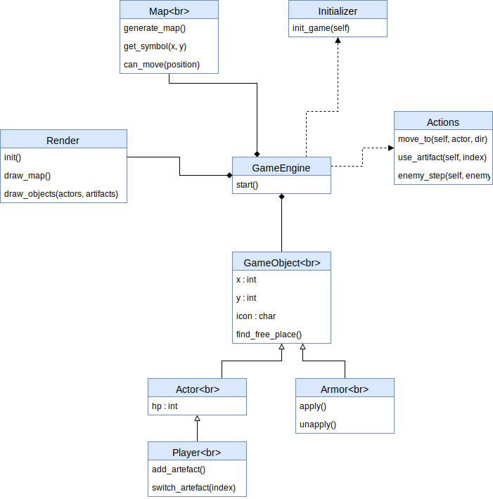

## Roguelike

#### Поиграть можно онлайн:

[ссылка на gh-pages](https://alexandraolegovna.github.io/au_software_design/src/)

#### Управление

* Перемещение: клавиши со стрелками
* Снять/надеть защиту `@` (если вы ее подобрали) : клавиша `1`
* Начать новую игру: перезагрузить страницу (`cntrl + r` в Chrome)
* Почитать логи: открыть консоль разработчиа (`cntrl + shift + j` в Chrome)

#### Логика игры:

1. чтобы победить, надо убить всех монстров
2. чтобы проиграть, надо лишиться всего здоровья
3. карта автогенерируемая, поэтому возможен вариант, когда вы не сможете победить :(
  p.s. зато проиграть сможете почти всегда :)

4. ваше текущее здоровье отображено на игровом поле в виде вашего персонажа (изначально это `3`)
5. все противники изображены символами `e` (здоровье противника 1)
6. игра идет по ходам: первый ход ваш, потом ходят по очереди все противники
7. вы можете ударить противника, который находится на соседней с вами клетке
8. противник может ударить вас, если вы находитесь на соседней с ним клетке
9. противник может ударить другого противники, если он находится на соседней с ним клетке
10. удар не инициирует переход в эту клетку (вы остаетесь на своей позиции)
11. вы можете подбирать артефакты (пока в игре только один артефакт `@`)
12. артефакт `@` дает вам безграничное здоровье (ваш перcонаж теперь `i`), если вы его надели; а если решите снять, то ваши очки здоровья будут такие, как до его использования
13. если вы решили использовать/не использовать артефакт, то это не является игровым ходом (противники не будут делать свой шаг)

#### Пример


#### Запустить игру у себя:

```
$ nmp install
```

теперь можно запустить статический сервер (если у вас есть), например:
```
$ static
```

или открыть файл `index.html`

запуск тестов:
```
$ npm test
```

Диаграмма классов:


