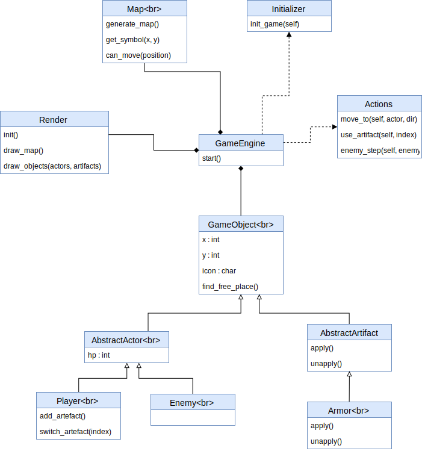
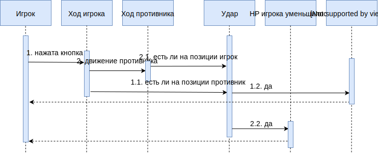
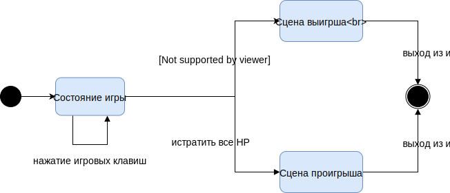

## Roguelike

#### Поиграть можно онлайн:

[ссылка на gh-pages](https://alexandraolegovna.github.io/au_software_design/src/)

### Общие сведения о системе

#### Управление

* Перемещение: клавиши со стрелками
* Снять/надеть защиту `@` (если вы ее подобрали) : клавиша `1`
* Начать новую игру: перезагрузить страницу (`cntrl + r` в Chrome)
* Почитать логи: открыть консоль разработчиа (`cntrl + shift + j` в Chrome)

#### Логика игры:

1. чтобы победить, надо убить всех монстров
2. чтобы проиграть, надо лишиться всего здоровья
3. карта автогенерируемая, поэтому возможен вариант, когда вы не сможете победить :(
  p.s. зато проиграть сможете почти всегда :)

4. вы управляете игроком; изначально, ваши очки здоровья равны `3`; здоровье отображено на игровом поле в виде вашего персонажа
5. все противники изображены символами `e` (здоровье противника `1`)
6. игра пошаговая: первый ход ваш, потом ходят по очереди все противники
7. вы можете ударить противника, который находится на соседней с вами клетке
8. противник может ударить вас, если вы находитесь на соседней с ним клетке
9. противник может ударить другого противника, если он находится на соседней с ним клетке
10. удар снимает одно очко здоровья
11. удар не инициирует переход в эту клетку (вы остаетесь на своей позиции после удара)
12. вы можете подбирать артефакты (пока в игре только один артефакт `@`)
13. артефакт `@` дает вам безграничное здоровье (ваш перcонаж теперь `i`), если вы его надели; а если решите снять, то ваши очки здоровья будут такие, как до его использования
14. применять/отменять действие артефактов можно клавишами `1`, `2`, ... в порядке их сбора (пока в игре только один артефакт, работает только клавиша `1`)
15. если вы решили применить/отменить действие артефакта, то это не является игровым ходом (противник не будут делать свой шаг)

#### Пример


#### Запустить игру у себя:

```
$ nmp install
```

теперь можно запустить статический сервер (если у вас есть), например:
```
$ static
```

или открыть файл `index.html`

запуск тестов:
```
$ npm test
```

### Описание типичного пользователя

Некий студент Петя типичный пользователь игры. Он любит проводить время зря и вместо подготовки к сессии играть в игры. Сначала он обязательно прочтет правила управления игрой (как и любой ответственный человек, который читает инструкцию перед использованием чего бы то ни было). Теперь он откроет саму игру. Он видит перед собой карту, по которой можно двигаться; артефакты, которые можно использовать; противников, которых можно убивать. После того, как он выиграл (убив всех противников) или проиграл (когда убили его), он перезагружаете станицу и начинает заново.

### Композиция и логическая структура


#### Диаграмма компонент:


Objects:
 - объекты игры : персонажи и артефакты

Map:
 - генерация карты

Render:
  - рендеринг игры на экран пользователю

GameEngine:
  - обработка всех действий и логики игры

#### Диаграмма классов:

Немного подробнее об архитектуре:



#### Диаграмма последовательностей:

Игра `GameEngine` запускается и инициализируется `Inizializer`'ом.

`Inizializer` создает начальное количество противников и артефактов на карте. `GameEngine` взаимодействует со `Actions` и получает направления движения игрока, перемещает его по карте и обрабатывает движение противников (случайным образом, если игрок далеко и по направлению к игроку, если он близко).

Во время движения игрока и противников ведется контроль за пересечением игроком других объектов на карте. Если герой хочет стать на клетку с противником, то он ударит противника, при этом не перейдет на желаемую клетку (он сможет перейти туда только на следующем шаге игры).

Если HP противника = 0, то он умирает (исчезает на карте).
Если HP игрока = 0, то игра заканчивается проигрышем.
Если игрок победил всех противников, то игра заканчивается выигрышем.



#### Диаграмма конечных автоматов:


